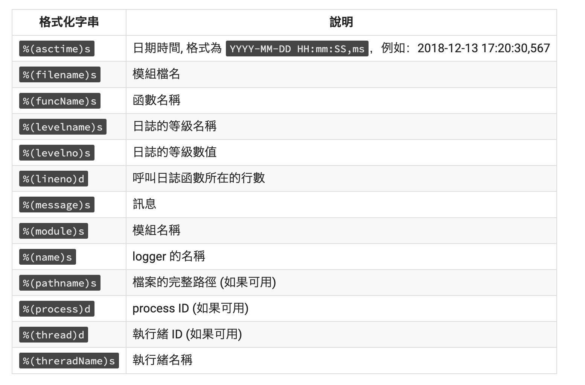

# yihsuanko-basic-training
## 基本訓練 - 使用VSCode
### 1. 執行程式的方式(一般執行、偵錯模式)
一般執行：開啟[file.py]後直接在terminal執行`python3 file.py`或是按control + f5 <br/>
偵錯執行：開啟[file.py]後，點選要debug的程式碼前方空白，出現紅色小圓點，按上方Run -> start Debugging或是按f5 <br/>
### 2. 設定執行參數(param)
git 或 python的其它套件 或 python 有不同的param 可以使用<br/>
透過git -h, python -h 了解更多選項<br/>
像是
```
--version
--help
```

### 3. 設定執行環境變數 (與參數的不同？)
執行`printenv` 或 `env`可以查詢目前已經設置的環境變量<br/>
shell 啟動的設定檔通常存在以下幾種其中之一的路徑：
```
etc/environment
etc/profile
~/.profile
~/.bashrc # 使用 bash 啟動 shell 的設定檔
~/.zshrc # 使用 zsh 啟動 shell 的設定檔
```

如果要輸出一個變數，在 shell 的基本指令可以用 `export` : <br/>
`export Pi=3.14159`<br/>
如果只在終端機打 `export` 指令，下次啟動時就會發現這個系統變數不見了。<br/>
如果要存在環境變數裡，使用 `vim` 編輯器編輯剛剛那些設定檔的其中之一，然後把剛剛的 export 指令加入後儲存就可以。<br/>
儲存好後重新啟動一下設定檔，用 `source` 指令<br/>

在python 中呼叫環境變數<br/>
```python
import os

print(os.environ) # 跟 shell 中的 env 指令一樣，印出所有儲存的系統變數
print(os.environ['Pi']) # 跟 shell 中 echo $Pi 一樣
```

### 4. 快速尋找方法或參數的「源頭」或是「有哪些方法在使用」

使用`help()`查看"modules", "keywords", "symbols", 或是 "topics"
範例
```python
help("list")
```
輸出結果
```
class list(object)
 |  list(iterable=(), /)
 |  
 |  Built-in mutable sequence.
 |  
 |  If no argument is given, the constructor creates a new empty list.
 |  The argument must be an iterable if specified.
 |  
 |  Methods defined here:
 |  
 |  __add__(self, value, /)
 |      Return self+value.
 |  
 |  __contains__(self, key, /)
 |      Return key in self.
 |  
 |  __delitem__(self, key, /)
 |      Delete self[key].
 |  
 |  __eq__(self, value, /)
 |      Return self==value.
 |  
 |  __ge__(self, value, /)
 |      Return self>=value.
 ....
```

使用python document 快速尋找有哪些方法在使用

### 5. 快速 reformat 程式碼，快速符合PEP8
使用autopep8快速排版
```
pip install autopep8
autopep8 --in-place --aggressive --aggressive <filename>
```

使用black快速排版的
```
pip install black
black <filename>
```

## 虛擬環境操作(virtualenv)
### 1. 如何判斷目前在正確的虛擬環境中
使用pip安裝virtualenv<br/>
`sudo pip install virtualenv`<br/>
透過virtualenv創造虛擬環境，在啟動虛擬環境的情況下，pip所安裝的套件只存在虛擬環境中，使得專案可以互相獨立，因此不同的專案可以安裝不同版本的使用套件。

建立新的虛擬環境<br/>
```python
cd [資料夾]
python3.9 -m venv venv #Python 3.5 後使用，第二個venv是虛擬環境的名字可以自己取名
../venv/bin/activate #此行venv 是虛擬環境的名字
```
輸入後前面有（venv）或是（自行取的虛擬環境名字）及成功切換到虛擬環境
關閉虛擬環境
```python
deactivate
```

### 2. requirements.txt
使用`pip freeze` 複製一整個已經安裝的套件清單。一個常見的慣例是放這整個清單到一個叫`requirements.txt`的檔案：
```python
pip freeze > requirements.txt
cat requirements.txt  # cat是輸出文件內容的指令
```
`requirements.txt` 用來提交到版本控制，並且作為釋出應用程式的一部分。使其他使用者可以透過 install -r 安裝對應的的套件：
```python
python -m pip install -r requirements.txt
```
## python 操作
### 1. Package 及 Module

#### Module
模組(Module)就是一個檔案，包含了相關性較高的程式碼。隨著應用程式的開發規模越來越大，我們不可能把所有的程式碼都寫在同一份Python檔案中，一定會將關聯性較高的程式碼抽出來放在不同的檔案中來形成模組(Module)，主程式再透過引用的方式來使用。所以模組(Module)可以提高程式碼的重用性(Reusable)且易於維護。<br/>

引用方式<br/>
```
from [module] import [需要的物件(function or class)]
from [module] import*  # 使用 * 來引用模組中的所有物件
import [需要的物件(function or class)]
```

在主程式 py檔中引用模組(Module)，並且執行後，會發現多了一個 pycache 資料夾。<br/>
這個資料夾中，可以看到包含了引用模組的已編譯檔案，當下一次執行主程式 py檔時，Python編譯器看到已編譯的模組檔案，會直接載入該模組(Module)，而省略編譯的動作，藉此來加速載入模組(Module)的速度。當然Python編譯器在每一次執行時，會檢查來源模組及已編譯檔案的時間，當來源模組的時間較新，則代表該模組(Module)有經過修改，則Python編譯器會再編譯一次，更新已編譯檔案。

#### Package
就是一個資料夾，包含了一個或多個的模組(Module)，並且擁有__init__.py檔案，其中可以撰寫套件(Package)初始化的程式碼。當專案中的模組(Module)越來越多時，這時候就可以再將相似的模組(Module)組織為套件(Package)。<br/>

引用方式<br/>
```
from [package] import [需要的物件(function or class)]
from [package] import*  # 使用 * 來引用模組中的所有物件
import [package].[需要的物件(function or class)]
```

#### dir()函式(dir function)
用來顯示物件(Object)的屬性(Attribute)及方法(Method)<br/>

常用的屬性(Attribute):<br/>
```python
# 從blog套件引用about模組
from blog import about

print(about.__name__)  # 模組名稱
print(about.__package__)  # 套件名稱
print(about.__file__)  # 模組的檔名及路徑
```

### 2. 環境變數如何設定與讀取(從 IDE、dotenv 設定)
安裝python-dotenv `pip install python-dotenv`
新增 .env 檔
並在 .env檔中設定變數
範例
```
MODE=development
DBHOST=localhost
DBPORT=5432
DBCONN_STR=${DBHOST}:${DBPORT}
```

```python
import os
from dotenv import load_dotenv

print('Before load_dotenv()', os.getenv('DBCONN_STR'))
load_dotenv()  # load_dotenv() 載入 .env 檔
print('After load_dotenv()', os.getenv('DBCONN_STR'))
```
執行結果
```
Before load_dotenv() None
After load_dotenv() localhost:5432
```

### 3. 如何執行一隻 python 程式
1. 在終端機使用 Python shell 執行
2. 利用一般文字編輯器撰寫程式檔，然後執行
3. 利用 IDE (Integrated Development Environment，整合式開發環境) 編輯及執行程式

### 4. 直接執行與 if __name__ == '__main__'差別在哪
`if __name__ == '__main__'`的意思是：當.py檔案被直接執行時，`if __name__ == '__main__'`之下的程式碼塊將被執行；當.py檔案以模組形式被匯入時，`if __name__ == '__main__'`之下的程式碼塊不被執行。<br/>

### 5. function(使用時機與操作方式)
為了避免同樣的程式碼重複出現在很多個地方，使得可讀性很低且不易維護，透過定義function解決重複性問題。<br/>

function 使用方法：
```python
def function_name(parameter):
    # 欲執行程式碼
    print(...)

# 使用
function_name()
```

**parameter(args, kwargs)** <br/>
參數簡單來說就是接收外部所傳來的資料，進而執行相關的邏輯運算。參數個數取決於函式內部運算時所需的資料個數，所以在一般情況下，呼叫函式時一定要傳入相對的參數個數資料，否則就會出現例外錯誤。

參數可分為：
1. 關鍵字參數(Keyword Argument)：呼叫函式時，在傳入參數值的前面加上函式所定義的參數名稱。
2. 預設值參數(Default Argument)：在函式定義的參數中，將可以選擇性傳入的參數設定一個預設值，當來源端有傳入該資料時，使用來源端的資料，沒有傳入時，則依照設定的預設值來進行運算。
```python
def function_name(name, birth, id=1):  # 使用此function時，一定要輸入name, birth，id如果沒輸入會自動為1
    # 欲執行程式碼
    print(name, birth, id)

function_name(name="Tom", birth="3/1", id=5)  # Tom 3/1 5 
function_name("Tom", "3/1", id=5)  # Tom 3/1 如果沒打參數名稱，一定要按順序給參數
function_name(name="Jack", birth="12/1")  # Jack 12/1 1 
```

*args、**kwargs <br/>
當我們要傳入大量的參數時，在函式上定義過多的參數名稱會讓程式碼的可讀性降低。
- 如果想打包成字典(Tuple)資料型態，使用 * 符號來將傳入參數進行打包。
- 如果想打包成字典(Dictionary)資料型態，則可以使用 ** 符號，且一定要使用關鍵字參數(Keyword Argument)。
```python
def fun(a, *args, **kwargs):
    print("a={}".format(a))
    for arg in args:
        print('Optional argument: {}'.format( arg ) )

    for k, v in kwargs.items():
        print('Optional kwargs argument key: {} value {}'.format(k, v))

fun(1,22,33, k1=44, k2=55)
```
執行結果
```python
a=1
Optional argument: 22
Optional argument: 33
Optional kwargs argument key: k1 value 44
Optional kwargs argument key: k2 value 55
```

### 6. return 與 yield

有無return值

```python
def function_name(parameter):
    # 欲執行程式碼
    print(...)

# 使用
function_name()  # print出print括號內東西
```

```python
def function_name(parameter):
    # 欲執行程式碼
    return(...)

# 使用
function_name()  # 執行函數，不會print出return內東西
print(function_name())  # print出return內東西
```

yield與return類似，用來**節省記憶體** <br/>
yield和return一樣會回傳值，不過yield會記住上次執行的位置<br/>
也就是yield回傳的不是一個數值，而是一個可迭代的生成器。<br/>
程式碼範例
```python
def yield_test(n):
    print("start n =", n)
    for i in range(n):
        yield i*i
        print("i =", i)

    print("end")

tests = yield_test(3)
for test in tests:
    print("test =", test)
    print("--------")
```
- 一開始呼叫函數時，正常運作 `print("start n =", n)` 得到 `start n = 5`
- 進入for迴圈，並遇到yield，此時i=0，回傳 0*0 = 0，並回到主程序。`print("test =", test)` 和 `print("--------")`後結束這次迭代。
- 接著進行第二次迭代，會從上次結束的下一行`print("i =", i)`開始，因此印出 `i = 0`。
- 接下來重複進行直到迭代結束，跳出for迴圈

執行結果
```
start n = 3
test = 0
--------
i = 0
test = 1
--------
i = 1
test = 4
--------
i = 2
end
```

### 7. Type Hint
Type Hint的優點
1. 可讀性更高、更好維護
2. 更容易 Debug

程式碼範例
```python
## 沒有 Type Hints
def send_request(request_data, headers, user_id, as_json):
    pass

## 有 Type Hints 型別註釋
def send_request(request_data : Any, # 可以是任何型別
                 headers: Optional[dict[str, str]], # 可以是 None 或者是從 str 映射到 str 的 dict
                 user_id: Optional[UserId] = None, # 可以是 None 或者是 UserId 類別
                 as_json: bool = True): # 必須是 bool
    pass
```

## 常見的資料結構(使用時機與操作方式)
### 1. list
List是一個資料型態，用來存放多個不同資料型態的資料(元素)。list 可以用來儲存一連串有順序性的元素。<br/>

List的特性：<br/>
1. Iterable(可疊代的)：所以for迴圈可以應用在串列上。<br/>
2. Modifiable(可修改的)：串列中的元素可以透過Python提供的串列方法(Method)來進行修改。<br/>

建立List的方法：<br/>
1. 以逗號分隔並且用 [] 符號將所有元素括起來。 `a = [1,2,3]`
2. 使用Python的list()，傳入Iterable(可疊代的)物件來建立串列。`a = list(range(10))`

存取使用List的方法：<br/>
1. Python串列的位置索引值從0開始，假設 `a = [1,2,3]`，想要得到1，`print(a[0])`
2. 使用 `[:]` 符號並傳入索引值，包含前不包含後
3. 使用append()，將元素新增至串列的最後。 `a.append(4)  # print(a) -> [1,2,3,4]`
4. 使用insert()，將元素新增至串列的特定位置。`a.instert(1,4)  # print(a) -> [1,4,2,3]`
5. 使用index()，可以將要尋找的串列元素傳入，它會回傳該元素的位置索引值，如果要尋找的串列元素不在串列中，則會出現錯誤訊息。如果此元素在串列中有多個，index()只會找第一個出現的。`print(a.index(1)) -> 0`

修改刪除List的方法：<br/>
1. 使用 [] 符號存取想修改的索引值，接著指派新的值 `a[1] = 1  # print(a) -> [1,1,3]`
2. 使用pop()，將串列的最後一個元素刪除。如果想刪除特定位置的元素，則傳入位置索引值。
3. 使用del 指令，指定要刪除的範圍位置索引值。
4. 使用remove()，傳入想刪除的元素。如果此元素在串列中有多個，remove()只會刪除第一個出現的。

### 2. set
Python set 物件是無序的集合(unordered collection)，**set集合不會包含重複的資料**。

建立set的方法：<br/>
1. 以逗號分隔並且用 {} 符號將所有元素括起來。 `b = {1,2,3}`
2. 使用Python的set()，傳入Iterable(可疊代的)物件。 `b = set((1,2,3))`

使用set的方法：<br/>
1. 使用remove()，傳入想刪除的元素。
2. 取 set 的交集要使用 & 符號就會取出兩集合中相同的元素。
3. 取 set 的聯集要使用 | 符號就會取出兩集合中所有的元素。
4. 取 set 的差集要使用 - 符號就會取出集合與另外一個集合的差集。

### 3. dictionary
dictionary (dict)是一個 key-value 對應的容器，能用key來查詢對應的value，所以一個dict裡的 key 是不會重複的，具有唯一性。
dict可以動態地新增與刪除資料，且資料儲存沒有順序性。

建立dict的方法：<br/>
1. 使用{}建立空dict，或包含key-value `c = {}`, `c = {"apple":1, "banana":2, "car":3}`
2. 使用dict()建立空dict `c = dict()`

使用dict的方法：<br/>
1. 新增資料：c["key"] = value `c["duck"] = 5`
2. 刪除資料：del c["key"] `del c["duck"]`
3. 測試key有沒有存在dict裡 `value1 = c.get('apple')`，如果 key 有存在的話就回傳該value，如果key沒有存在的話就回傳預設值，沒有給定預設值的話會回傳None。

## logging
### 1. 層級與意義
logging為開發者提供了5種程度不同的描述來紀錄訊息<br/>
依嚴重程度排列如下：<br/>
debug < info < warrning < error/exception < critical <br/>
logger 提供 level 來過濾嚴重程度比較不高的messeage。<br/>
logging 模組預設等級為 WARNING，大於或等於 WARNING 等級的訊息才會被記錄。<br/>

程式碼範例
```python
import logging
logging.basicConfig(level = logging.INFO)  # 將level設為info，因此debug不會印出

logging.debug('Hello debug')
logging.info("Hello info")
logging.warning("Hello warning")
logging.error("Hello errtr")
logging.critical("Hello critical")
```
印出結果
```
INFO:root:Hello info
WARNING:root:Hello warning
ERROR:root:Hello errtr
CRITICAL:root:Hello critical
```


```python
import logging

try:
    x = 5 / 0
except:
    # 加上 exc_info=True 紀錄 Exception 內容 或直接使用logging.exception('Catch an exception.')
    logging.error("Catch an exception.", exc_info=True)  
```



```python
import logging

FORMAT = '%(asctime)s %(levelname)s: %(message)s'  # 顯示出的格式，可以自己修改、asctime日期時間, 格式為 YYYY-MM-DD HH:mm:SS,ms
DATE_FORMAT = '%Y%m%d %H:%M:%S'  # 更改日期格式
logging.basicConfig(level=logging.DEBUG, format=LOGGING_FORMAT, datefmt=DATE_FORMAT)

logging.debug('debug message')
logging.info('info message')
logging.warning('warning message')
logging.error('error message')
logging.critical('critical message')
```

### 2. 如何輸出至 file

1. logging.basicConfig()
只要在logging.basicConfig() 內的 filename 參數設定要儲存的日誌檔名，就可以將 logging儲存。

```python
import logging

FORMAT = '%(asctime)s %(levelname)s: %(message)s'  # 顯示出的格式，可以自己修改、asctime日期時間, 格式為 YYYY-MM-DD HH:mm:SS,ms
DATE_FORMAT = '%Y%m%d %H:%M:%S'  # 更改日期格式
logging.basicConfig(level=logging.DEBUG, filename='myLog.log', filemode='w', format=FORMAT)

logging.debug('debug message')
logging.info('info message')
logging.warning('warning message')
logging.error('error message')
logging.critical('critical message')
```

2. fileConfig

## git
### 1. 如何建立 git repository
進入github個人主頁面，新增repository<br/>
填寫repository name，相當於這個專案的名稱<br/>
git 到想要的本地資料夾
### 2. 全新的專案
如果要建立全新的專案，進入github個人主頁面，新增repository<br/>
```python
cd [資料夾]
git clone [url]  # 在repository有一個綠色code按鈕，點選可以找到url連結 
```
避免多人合作時衝突，如果有修人改過檔案，需要先pull後push
```python
# git pull 方式
git pull 
# push前，轉到要push的分支
git branch -M main  
# git push 方式
git add .
git commit -m "message"  # 紀錄commit的方式
git push -u origin main
```
### 3. 已經有用 git 版控的專案
```python
git remote add origin <your url>
```
### 4. 如何紀錄(commit)
```python
git commit -m "message"  # 將跟改內容簡單記錄，方便其他人理解跟改內容
```
### 5. 何為衝突(conflict)
當上傳內容與原本內容不同或合併分支內容有不同時，會出現衝突


## Python PEP8 命名規範 (Naming Conventions)
1. _inside_variable：單底線開頭，作為內部變數使用，`form M import*`不會匯入以底線開始的變數。
2. Module Names：簡短全小寫，可使用底線。(ner_predict)
3. Package Names：簡短全小寫，不使用底線。(app)
4. Class Names：首字母大寫，Camel Case，不使用底線。（ResultOutput）
5. Function Names：小寫
